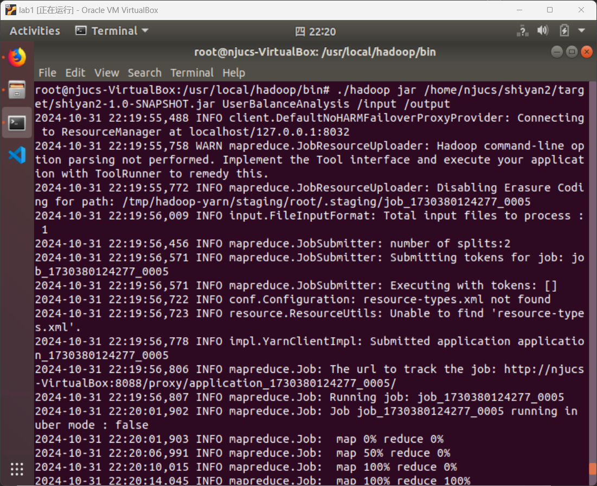
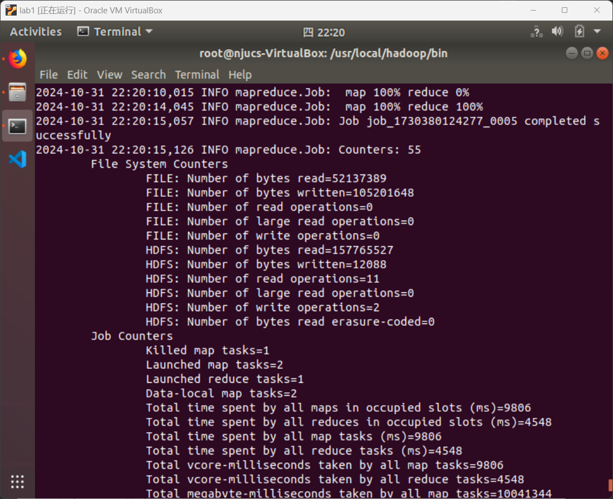
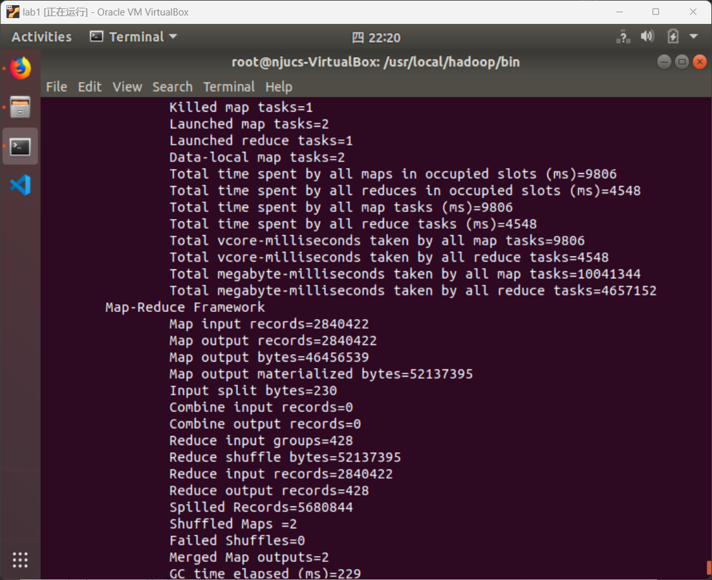
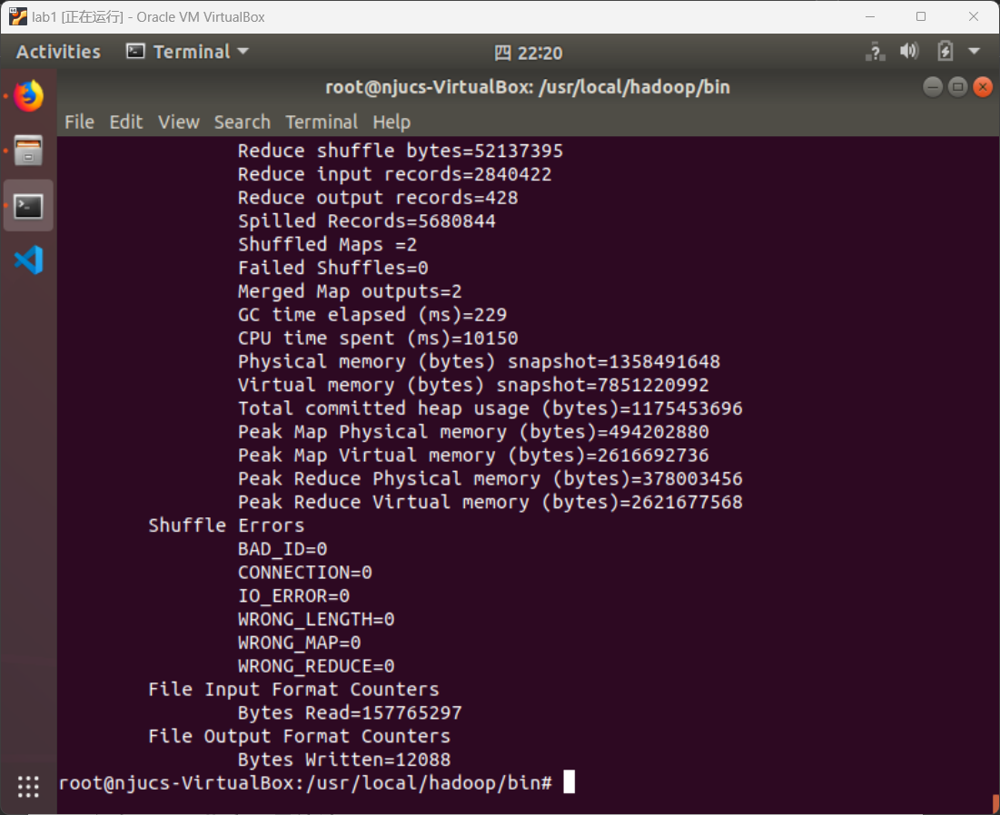

<center><div style='height:4mm;'></div><div style="font-family:华文楷体;font-size:25pt;"><b>金融大数据处理技术 实验二
    （任务一：每日资金流入流出统计）</b></div></center>

<center><div style='height:2mm;'></div><div style="font-family:华文楷体;font-size:14pt;"><b>221275010 屈航</b></div></center>

# 1、设计思路

## 1.1、 Mapper的设计思路

**`Mapper`重构了一个`map`函数。**

`map`函数主要实现了对于 `user_balance_table.csv`中的按照` report_date`相同的条目来统计所有⽤户每⽇的`total_purchase_amt`资⾦流⼊与 `total_redeem_amt`资金流出的总和。

因为考虑到求和得到的数据量可能很大，导致会超出`int`类型的表示范围，故实现的过程中的资金流入流出量的数据类型都是**`BigInteger`**。

因为要传输两个值，即每⽇的`total_purchase_amt`资⾦流⼊与 `total_redeem_amt`资金流出，故可以把这两个数据作为一个`BalanceWritable`类来作为`value`进行键值对的传输。

以下是**`BalanceWritable`类**的部分构造语句：

```java
public static class BalanceWritable implements Writable {
        private BigInteger inflow;
        private BigInteger outflow;
    
        public BalanceWritable() {
            this.inflow = BigInteger.ZERO;
            this.outflow = BigInteger.ZERO;
        }
    
        public void set(BigInteger inflow, BigInteger outflow) {
            this.inflow = inflow;
            this.outflow = outflow;
        }
    	@Override
        public void write(DataOutput out) throws IOException {
            out.writeUTF(inflow.toString());
            out.writeUTF(outflow.toString());
        }
    
        @Override
        public void readFields(DataInput in) throws IOException {
            inflow = new BigInteger(in.readUTF());
            outflow = new BigInteger(in.readUTF());
        }
```

以下是**`map`函数**的主要功能语句：

```java
String[] fields = value.toString().split(",");
if (fields.length < 10) return; // Check for valid row

String reportDate = fields[1]; // report_date
BigInteger totalPurchaseAmt = parseBigInteger(fields[4]); //total_purchase_amt
BigInteger totalRedeemAmt = parseBigInteger(fields[8]); // total_redeem_amt

dateKey.set(reportDate);
balanceWritable.set(totalPurchaseAmt, totalRedeemAmt);
context.write(dateKey, balanceWritable);
```

*<u>**注意：实验开始前要对 `user_balance_table.csv`中的第一行删去，第一行并不是需要统计的内容。**</u>*

## 1.2、Reducer的设计思路

**`Reducer`包含有一个`reduce`函数。**

**`reduce`函数**就是实现对输入的每一个键值对统计相同键（日期）下的`total_purchase_amt`资金流入与 `total_redeem_amt`资金流出的总和，也就是实现对`value`的`BalanceWritable`类型数据的求和，最后把按照< 日期 >  TAB < 资金流⼊量 >,< 资金流出量 >格式进行输出。

以下是`reduce`函数的主要功能语句：

```java
BigInteger totalInflow = BigInteger.ZERO;
BigInteger totalOutflow = BigInteger.ZERO;

for (BalanceWritable val : values) {
    totalInflow = totalInflow.add(val.getInflow());
    totalOutflow = totalOutflow.add(val.getOutflow());
}

result.set(totalInflow.toString() + "," + totalOutflow.toString());
context.write(key, result);
```

## 1.3、项目运行的配置设计

- 此次项目主要使用**`Maven`**进行项目管理，通过编辑**`pom.xml`**文件对该项目进行配置。`pom.xml`文件的配置信息包含有该项目需要哪些库文件需要下载，该项目的项目文件有哪些。


- 依次使用`mvn clean install`进行配置，同时还可以使用`mvn compile`对`.class`文件进行生成，`mvn package`实现对项目文件的`.class`文件打包成`jar`文件。


- 将`user_balance_table.csv`上传至**HDFS**的`/input`文件夹里面，最后运行该项目的`jar`文件，运行命令为：


```bash
./hadoop jar /home/njucs/shiyan2/target/shiyan2-1.0-SNAPSHOT.jar UserBalanceAnalysis /input /output
```

<u>***注意要把导出来的 part-r-00000解锁，以实现普通用户可以打开，命令如下：***</u>

```bash
sudo chown $USER part-r-00000
```

# 2、程序运行结果

以下即为**`UserBalanceAnalysis.java`**程序执行的任务一（根据 `user_balance_table` 表中的数据，统计所有⽤户每日的资⾦流入与 流出情况。资金流入意味着申购⾏为，资⾦流出为赎回行为。输出格式为"< 日期 > TAB < 资金流⼊量 >,< 资金流出量 >“）的运行结果：

- **程序运行结果图：**









- **part-r-00000输出结果图：**


# 3、WEB页面截图

因为我第一次的程序代码有bug，运行失败了，于是我又修改了一下代码，第二次就`SUCCEEDED`了，同时输出结果也符合预期。


