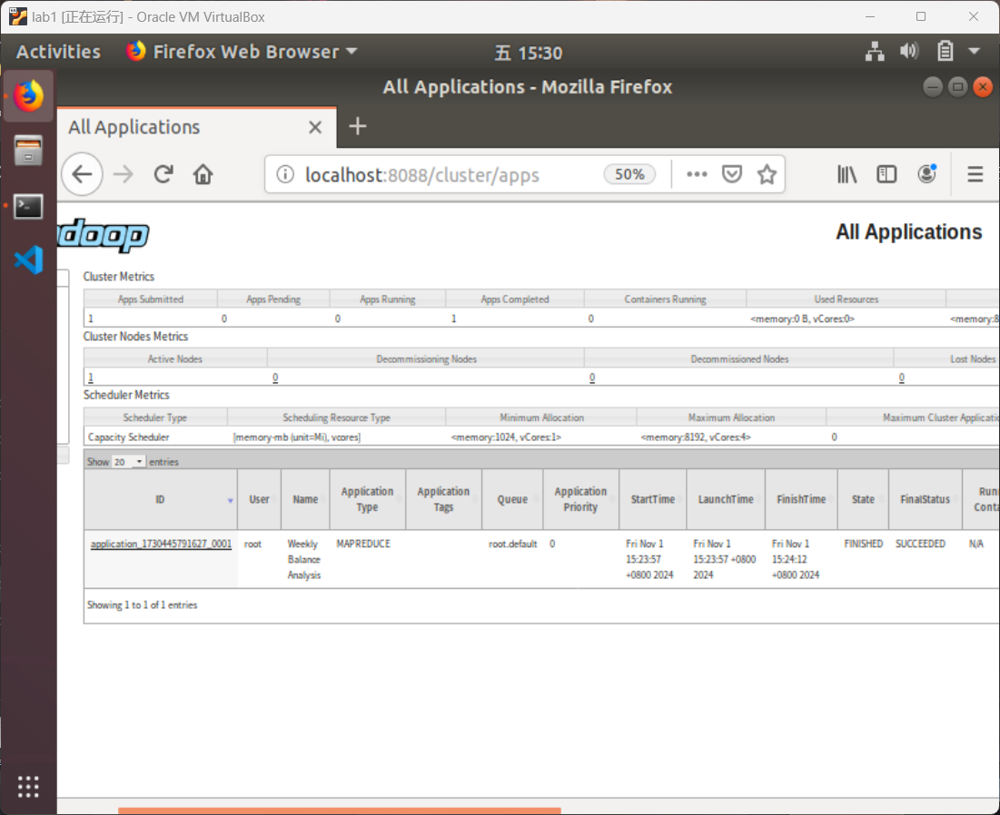

<center><div style='height:4mm;'></div><div style="font-family:华文楷体;font-size:25pt;"><b>金融大数据处理技术 实验二（任务二：星期交易量统计）</b></div></center>

<center><div style='height:2mm;'></div><div style="font-family:华文楷体;font-size:14pt;"><b>221275010 屈航</b></div></center>

# 1、设计思路

## 1.1、 Mapper的设计思路

**`Mapper`重构了一个`map`函数。**

`map`函数主要实现了对 任务一生成的`part-r-00000`中的统计⼀周七天中每天的平均资⾦流⼊与流出情况，并按照资金流⼊量从大到小排序。主要涉及到对于日期转化为星期几，日期转星期的过程可以用一个**`Calendar`类**来实现，实现的主要代码例如`calendar.setTime(dateFormat.parse(dateString));`,然后再把`calendar`类型转化为可以表征星期的`int`类型数字，代码为`int dayOfWeek = calendar.get(Calendar.DAY_OF_WEEK) - 1; // 转换为0（周日）到6（周六）`这样就可以再通过`int`类型转化为星期的字符串。

因为考虑到求和得到的数据量可能很大，导致会超出`int`类型的表示范围，故实现的过程中的资金流入流出量的数据类型都是**`BigInteger`**。

因为要传输两个值，即每⽇的`total_purchase_amt`资⾦流⼊与 `total_redeem_amt`资金流出，故可以把这两个数据作为一个**`BalanceWritable`类**来作为`value`进行键值对的传输。

以下是**`BalanceWritable`类**的部分构造语句：

```java
public static class BalanceWritable implements Writable {
        private BigInteger inflow;
        private BigInteger outflow;
    
        public BalanceWritable() {
            this.inflow = BigInteger.ZERO;
            this.outflow = BigInteger.ZERO;
        }
    
        public void set(BigInteger inflow, BigInteger outflow) {
            this.inflow = inflow;
            this.outflow = outflow;
        }
    	@Override
        public void write(DataOutput out) throws IOException {
            out.writeUTF(inflow.toString());
            out.writeUTF(outflow.toString());
        }
    
        @Override
        public void readFields(DataInput in) throws IOException {
            inflow = new BigInteger(in.readUTF());
            outflow = new BigInteger(in.readUTF());
        }
```

以下是**`map`函数**的主要功能语句：

```java
String[] fields = value.toString().split("\t");
if (fields.length != 2)
    return;

String[] amounts = fields[1].split(",");
if (amounts.length != 2)
    return;

BigInteger inflow = new BigInteger(amounts[0]);
BigInteger outflow = new BigInteger(amounts[1]);

// int lineIndex = (int) (key.get() + 1);
// int dayIndex = (lineIndex - 1) % 7; // 0到6表示一周中的天
// String weekDay = getWeekDay(dayIndex);
String dateString = fields[0];
Calendar calendar = Calendar.getInstance();
try {
    calendar.setTime(dateFormat.parse(dateString));
} catch (ParseException e) {
    e.printStackTrace();
}
int dayOfWeek = calendar.get(Calendar.DAY_OF_WEEK) - 1; // 转换为0（周日）到6（周六）

String weekDay = getWeekDay(dayOfWeek);

weekKey.set(weekDay);
balanceWritable.set(inflow, outflow);
context.write(weekKey, balanceWritable);
```

*<u>**注意：实验开始前要对 `user_balance_table.csv`中的第一行删去，第一行并不是需要统计的内容。**</u>*

## 1.2、Reducer的设计思路

**`Reducer`包含有`reduce`函数和`cleanup`函数。**

1. **`reduce`函数**就是实现对于同一个key的`Iterable<BalanceWritable> values`中的每一个元素也就是统计数求平均，最后再将求平均的结果存入一个叫做**`TreeMap<BigInteger, String> sortedResults = new TreeMap<>(Comparator.reverseOrder())`**的类里面，这个类会针对键`key`，此时的键是**平均资金流入量**，进行**倒序排序**，以待`cleanup`函数实现对输出格式的处理。
   以下是`reduce`函数的主要功能语句：

   ```java
   BigInteger totalInflow = BigInteger.ZERO;
   BigInteger totalOutflow = BigInteger.ZERO;
   int count = 0;
   
   for (BalanceWritable val : values) {
       totalInflow = totalInflow.add(val.getInflow());
       totalOutflow = totalOutflow.add(val.getOutflow());
       count++;
   }
   
   BigInteger avgInflow = totalInflow.divide(BigInteger.valueOf(count));
   BigInteger avgOutflow = totalOutflow.divide(BigInteger.valueOf(count));
   
   // 使用 TreeMap 存储结果，按资金流入量排序
   sortedResults.put(avgInflow, key.toString() + "," + avgOutflow);
   }
   ```

2. **`cleanup`函数**就是实现对输出结果的格式控制。对于`reduce`函数中实现的**键**为**平均资金流入量**，**值**为**String(星期，平均流出量)**，这已经按照平均资金流入量完成了倒序排序了，所以只需要把键值对的3个值修改一下位置依次输出即可。
   以下是**`cleanup`函数**的主要功能语句：

   ```java
   for (Map.Entry<BigInteger, String> entry : sortedResults.entrySet()) {
       String[] values = entry.getValue().split(","); // 分割星期和流入、流出
       String day = values[0].trim(); // 获取星期
       String out_num = values[1].trim();
       result.set(entry.getKey().toString() +","+ out_num);
       context.write(new Text(day), result);
   }
   ```

## 1.3、项目运行的配置设计

- 此次项目主要使用**`Maven`**进行项目管理，通过编辑**`pom.xml`**文件对该项目进行配置。`pom.xml`文件的配置信息包含有该项目需要哪些库文件需要下载，该项目的项目文件有哪些。


- 依次使用`mvn clean install`进行配置，同时还可以使用`mvn compile`对`.class`文件进行生成，`mvn package`实现对项目文件的`.class`文件打包成`jar`文件。


- 将`part-r-00000`上传至**HDFS**的`/input`文件夹里面，最后运行该项目的`jar`文件，运行命令为：


```bash
./hadoop jar /home/njucs/shiyan2_2/target/shiyan2_2-1.0-SNAPSHOT.jar WeeklyBalanceAnalysis /input /output_2
```

<u>***注意要把导出来的 part-r-00000解锁，以实现普通用户可以打开，命令如下：***</u>

```bash
sudo chown $USER part-r-00000
```

# 2、程序运行结果

以下即为**`WeeklyBalanceAnalysis.java`**程序执行的任务二（基于任务⼀的结果，编写统计⼀周七天中每天的平均资金流⼊与流出情况，并按照资金流⼊量从大到小排序。输出格式为" TAB < 资金流⼊量 >,< 资金流出量 >“）的运行结果：

- **程序运行结果图：**


- **part-r-00000输出结果图：**


# 3、WEB页面截图



