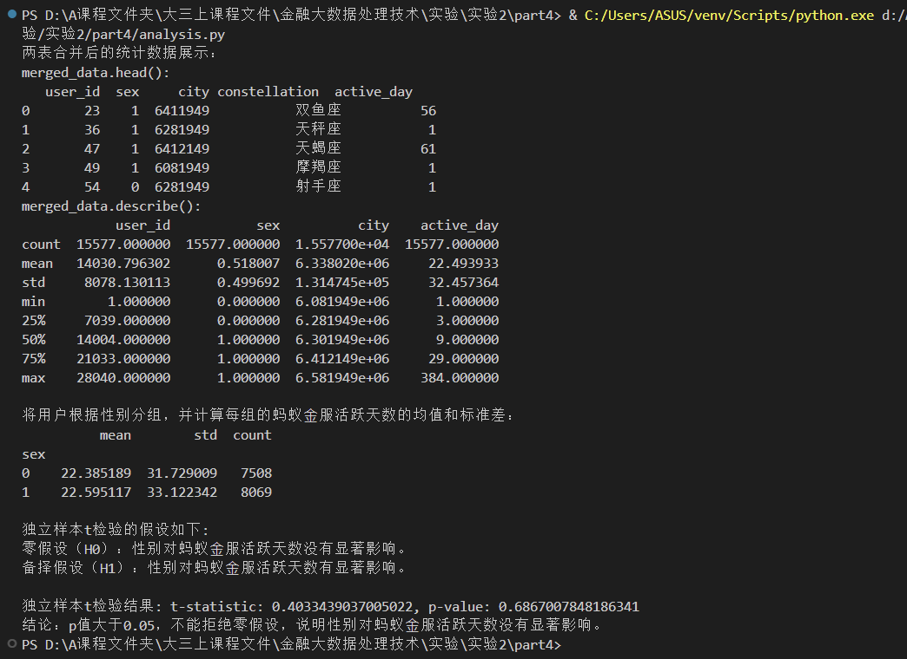
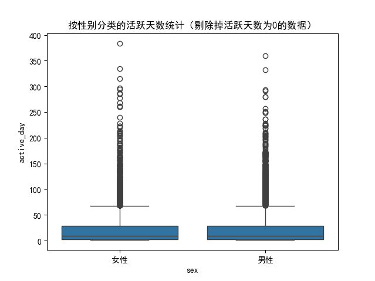

<center><div style='height:4mm;'></div><div style="font-family:华文楷体;font-size:25pt;"><b>金融大数据处理技术 实验二（任务四：交易行为影响因素分析
）</b></div></center>

<center><div style='height:2mm;'></div><div style="font-family:华文楷体;font-size:14pt;"><b>221275010 屈航</b></div></center>

# 1、设计思路

## 1.1、整体设计

<u>我在任务四所做的统计分析旨在研究**用户性别**对用户在**蚂蚁金服平台的活跃天数**的影响。</u>

首先，通过合并用户画像数据和活跃天数数据，我们对数据进行了预处理，确保分析**基于活跃天数大于零**的有效用户。

接着，对数据进行了描述性统计，了解整体特征，并根据性别对用户进行分组，以计算不同性别用户的活跃天数的均值、标准差及用户数量。为了检验性别是否对活跃天数有显著影响，我们设定了**独立样本t检验**的假设，**零假设**为性别对活跃天数没有显著影响，**备择假设**则为存在显著影响。通过t检验结果，我们分析了**p值**，并得出了相应的结论。

最后，利用箱型图可视化了性别与活跃天数的关系，便于更直观地呈现结果。

本次实验采用的数据是用任务三中通过`user_balance_table.csv`文件，编写 MapReduce 程序，统计每个用户的活跃天数，并按活跃天数降序排列，最后生成的**用户活跃天数统计表`part-r-00000`**，以及**用户信息表`user_profile_table.csv`**当中的对于用户的性别数据进行探究**用户性别**对用户在**蚂蚁金服平台的活跃天数**是否有显著影响。

## 1.2、代码设计

因为涉及到**独立样本t检验**，python在这数值分析方面有很多可以直接调用的库，以及用户活跃天数统计表`part-r-00000`在之前也已经通过`mapreduce`程序生成了，而且数据量也不是特别大，所以在实验四中，我主要采用python语言进行代码编写，最终生成`analysis.py`文件。

1. **数据预处理**

   将`user_profile_table.csv`和`part-r-00000`中的数据通过`user_id`来实现两个数据表的合并操作，同时剔除掉活跃天数为0的用户，我们此处只分析活跃天数大于0的有效用户，预处理代码如下：

   ```python
   #* 1. 数据预处理
   user_profile = pd.read_csv('user_profile_table.csv')
   active_days = pd.read_csv('part-r-00000', delimiter='\t', header=None, names=['user_id', 'active_day'])
   
   # 合并两个数据框
   merged_data = pd.merge(user_profile, active_days, on='user_id', how='inner')
   
   # 剔除活跃天数为0的数据
   merged_data = merged_data[merged_data['active_day'] > 0]
   
   # 重置索引
   merged_data.reset_index(drop=True, inplace=True)
   ```

2. **数据的统计分析**

   将合并的数据表进行展示和简单的统计分析，来判断前面的程序运行结果是否正确，以及获得一些基本的数据分布特征，统计分析的代码如下：

   ```python
   #* 2. 数据的统计分析
   
   print('两表合并后的统计数据展示：')
   print('merged_data.head():')
   print(merged_data.head())
   print('merged_data.describe():')
   print(merged_data.describe())
   
   # 数据分组
   print('\n将用户根据性别分组，并计算每组的蚂蚁⾦服活跃天数的均值和标准差：')
   grouped_data = merged_data.groupby('sex')['active_day'].agg(['mean', 'std', 'count'])
   print(grouped_data)
   ```

3. **假设检验**

   为实验建立零假设和备择假设，分别抽取**男性**用户和**女性**用户的**活跃天数向量**，对不同性别的用户的蚂蚁金服活跃天数进行独立样本t检验，得到最后的t统计量和p值，根据p值来判断性别对蚂蚁⾦服活跃天数是否有显著影响。**p值小于0.05, 拒绝零假设，说明性别对蚂蚁金服活跃天数有显著影响**；**p值大于0.05，不能拒绝零假设，说明性别对蚂蚁金服活跃天数没有显著影响**。假设检验的代码如下：

   ```python
   #* 3. 假设检验
   print('\n独立样本t检验的假设如下:')
   print('零假设（H0）：性别对蚂蚁⾦服活跃天数没有显著影响。')
   print('备择假设（H1）：性别对蚂蚁⾦服活跃天数有显著影响。')
   
   # 分别提取男性和女性的活跃天数
   male_active_days = merged_data[merged_data['sex'] == 1]['active_day']
   female_active_days = merged_data[merged_data['sex'] == 0]['active_day']
   
   # 进行t检验
   t_stat, p_value = stats.ttest_ind(male_active_days, female_active_days)
   
   print(f'\n独立样本t检验结果: t-statistic: {t_stat}, p-value: {p_value}')
   
   if p_value < 0.05:
       print('结论：p值小于0.05, 拒绝零假设，说明性别对蚂蚁⾦服活跃天数有显著影响。')
   else:
       print('结论：p值大于0.05，不能拒绝零假设，说明性别对蚂蚁⾦服活跃天数没有显著影响。')
   ```

4. **可视化展示**

   把不同性别的用户的活跃天数做成统计图展示出来，代码如下：

   ```python
   #* 4. 可视化展示
   # 设置全局字体为中文
   matplotlib.rcParams['font.sans-serif'] = ['SimHei']  # 黑体
   matplotlib.rcParams['axes.unicode_minus'] = False  # 解决负号显示问题
   sns.boxplot(x='sex', y='active_day', data=merged_data)
   plt.xticks([0, 1], ['女性', '男性'])
   plt.title('按性别分类的活跃天数统计（剔除掉活跃天数为0的数据）')
   plt.show()
   ```

# 2、程序运行结果

最终通过统计分析得到最后的**独立样本t检验结果**` t-statistic: 0.4033439037005022, p-value: 0.6867007848186341`，因为**p值大于0.05，所以说明不能拒绝零假设，说明性别对蚂蚁金服活跃天数没有显著影响**。

- 终端运行结果图：



- 不同性别的活跃天数统计图：

